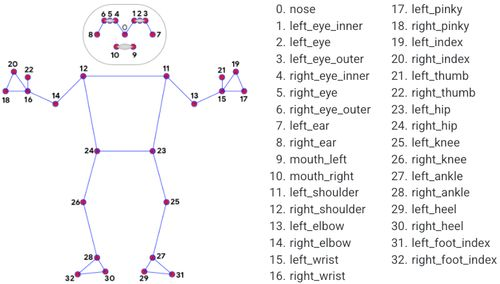

# Pose Estimation (Work in Progress)

## Status

Work in progress — pose detection and multi-person color-coding are working; rep-counting logic (joint angle calculation) is not yet built.

## File structure

This project isn't one monolithic script — it's split into a scratch version and two parallel module/runner pairs:

- **`pose_estimation_scratch.py`** — the original no-class script. IMAGE mode, raw landmark printing. Kept for history/progression, not the working deliverable.
- **`pose_module_IMAGE.py`** — importable `poseDetector` class, IMAGE mode. Basic detection, drawing, and position extraction. No `main()` — meant to be imported.
- **`pose_module_VIDEO.py`** — importable `poseDetector` class, VIDEO mode. Adds per-person random color assignment (`get_color`). No `main()` — meant to be imported.
- **`pose_detector_IMAGE.py`** — runner script. Imports `pose_module_IMAGE` and runs IMAGE-mode detection on a video file.
- **`pose_detector_video`** — runner script. Imports `pose_module_VIDEO` and runs VIDEO-mode detection with per-person color coding.

## What it does

Detects body pose landmarks on video and draws them. The VIDEO-mode version additionally assigns each detected person a unique, persistent color.



## Tools used

- Python
- OpenCV
- MediaPipe Tasks API (PoseLandmarker)

## How to run

**IMAGE-mode runner:**
```bash
source cv-env/bin/activate
pip install -r requirements.txt
python3 pose_detector_IMAGE.py
```

**VIDEO-mode runner (with per-person color coding):**
```bash
source cv-env/bin/activate
pip install -r requirements.txt
python3 pose_detector_video
```

## Key decision: migrating to MediaPipe's new Tasks API

MediaPipe 1.0 removed the legacy `mp.solutions` interface most tutorials use. Built on `PoseLandmarker` from the Tasks API instead of downgrading.

## Key decision: IMAGE mode vs VIDEO mode

I started with `detect()`, which is IMAGE mode, since that's the default. But once I had two people in frame, the tracking looked glitchy, and I figured out why. IMAGE mode treats every frame like a totally separate photo with no memory of the last frame. So the model has nothing stopping it from wobbling or losing track between frames.

`detect_for_video()` fixes this by taking a timestamp with each frame, so the model knows these frames are connected in time, not random pictures. That let it use the previous frame as context instead of guessing fresh every time. Tracking got noticeably steadier, not perfect, but a real improvement for a live video feed.

## Key decision: model size

I tested all three sizes on the same setup:

Lite was the fastest, ran smooth and responsive, accuracy was good enough for basic tracking though a little less steady on fine detail sometimes.

Full was noticeably slower than lite but the landmarks felt more stable and accurate, especially on joints that matter for something like counting reps later.

Heavy was the slowest one. Accuracy felt slightly better than full, but the FPS drop was big enough to feel laggy, and I noticed a side effect from that: lower FPS meant more real time passed between processed frames, which made tracking less reliable in VIDEO mode since bigger jumps between frames made it harder to match the same person consistently.

I ended up sticking with full since it was the best balance of accuracy and tracking stability for this project.

## Feature: per-person color coding

The goal was that every new person who shows up gets their own color, and no color ever repeats.

First I check if this person, using their index in the frame, already has a color saved in a dictionary. If not, I generate three random numbers between 0 and 255 for R, G, B and combine them into one color. Before accepting it, I check if that exact color is already used by someone else. If it is, I throw it out and generate a new one, and keep doing that until I land on one nobody else has. Once it's genuinely unique, I save it in the dictionary using that person's index as the key. Next time I ask for that same person's color it just returns the saved one instead of making a new one, so they keep the same color as long as their index stays the same.

## Known limitations

**Colors can reassign if tracking drops.** This was the trickiest thing I ran into. My color system is based on a person's position in MediaPipe's detection list each frame, but MediaPipe doesn't give each person a lasting ID the way ByteTrack did with `tracker_id` back in Project 1. So if tracking briefly loses someone from a quick movement, an occlusion, or a confidence dip, and they get redetected, they might land at a different index than before, which means they can end up with a different color than a second earlier. It's not that the person is actually lost in a broken way, it's more that my coloring system has no way to know this is the same person as before the way a real tracker would.

**Higher confidence thresholds cut false detections but increase glitching.** I raised `min_pose_detection_confidence`, `min_pose_presence_confidence`, and `min_tracking_confidence` to reduce shaky or false detections. That worked, but it came with a tradeoff. Stricter thresholds mean the model gives up tracking more easily when things get even slightly uncertain, which showed up as more frequent brief tracking drops, and by extension more of the color reassignment issue above.

**Portrait vs landscape videos need different resize handling.** I originally had a fixed resize that stretched every video into the same box no matter its real shape. Fixed it by scaling based on aspect ratio instead, but that means different videos end up at different final sizes instead of one uniform size. That's correct behavior, just worth knowing going in.

**Two-person scenes are still genuinely hard when limbs overlap.** Even with `num_poses` set right and thresholds tuned, if two people's arms or legs get close or crossed, the model can still occasionally mix up which joint belongs to which person for a frame or two. This seems like a real limitation of pose estimation under occlusion, not something I can fully fix by tuning, so I documented it instead of chasing a perfect fix.

## Next steps

Rep-counting logic (joint angle calculation from landmark positions) is the next planned feature, not yet implemented.
